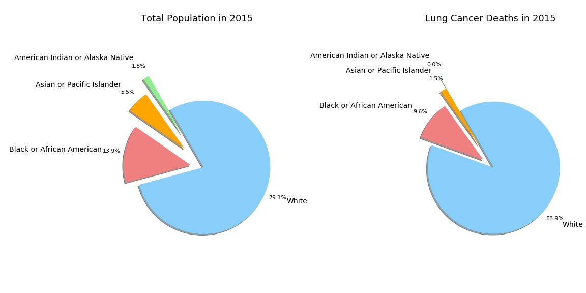
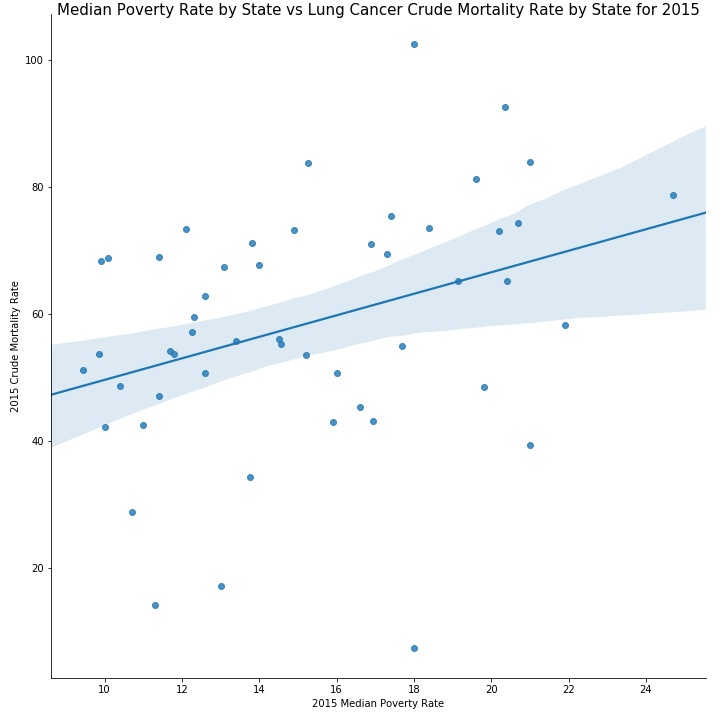
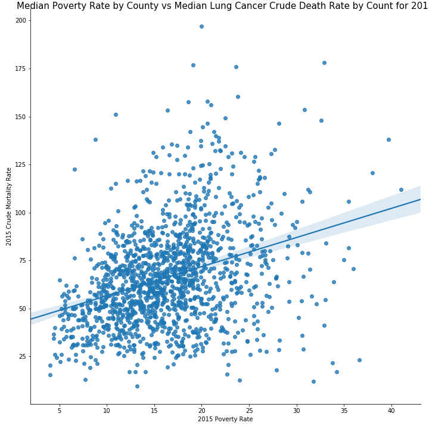
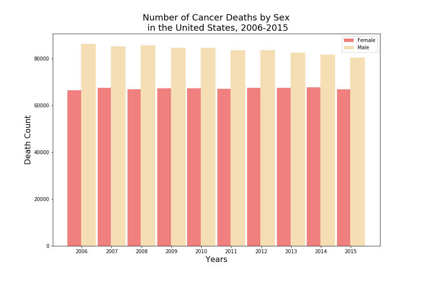
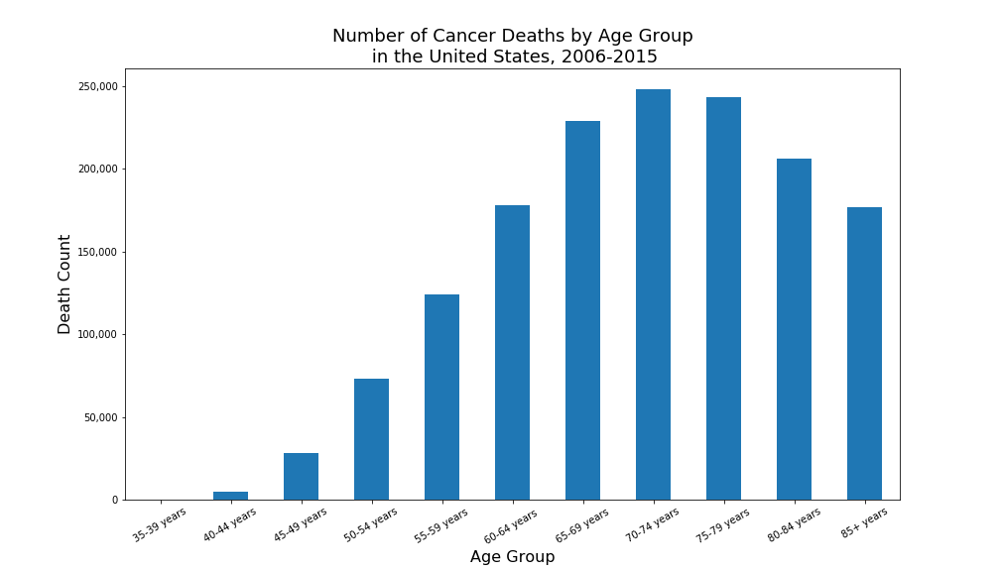
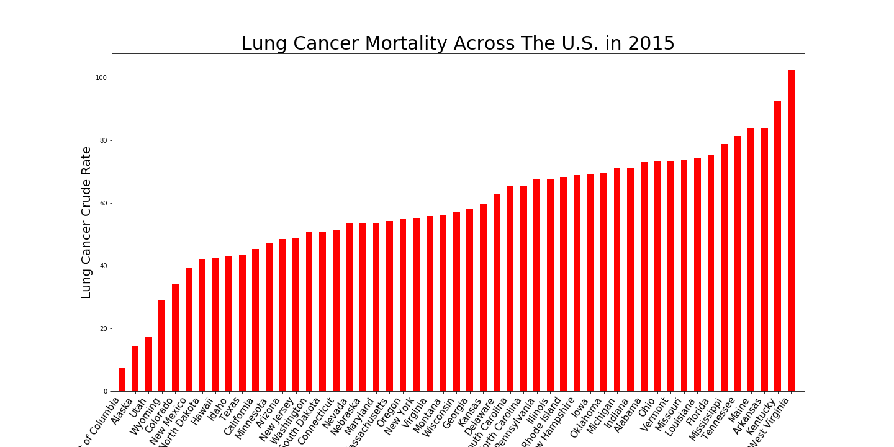

# Lung Cancer: Death & Demographics

## Team Members
* Abear Awadallah
* Mike Ingram
* Gretel Uptegrove
* Brown Varghese

## Motivation

* Lung cancer is one of the six leading causes of death in the World (according to WHO-World Health Organization)
* Hypothesis: There is a correlation between a person’s demographics and their chances of dying of lung cancer
* Questions: What demographics are correlated with lung cancer mortality?

## Sources
* [CDC Wonder](https://wonder.cdc.gov/)
    * Lung Cancer Deaths broken down by:
        * Location (State & County Level)
        * Race
        * Age Range (by 5 year increments)
        * Gender
* [FRED Economics Data](https://fred.stlouisfed.org/)
    * Poverty Rate broken down by Location (State & County Level)

## Methods
* Query CDC Wonder and FRED Economics Data databases
* Clean data using pandas library in Python within a [Jupyter notebook: Data_Cleaning.ipynb](Data_Cleaning.ipynb)
* Create charts and perform statistical analysis using various Python libraries including PANDAS, NumPy, and Matplotlib within a [Jupyter notebook: Data_Analysis.ipynb](Data_Analysis.ipynb)

## Major Findings

### Race & Lung Cancer Mortality

* Hypothesis:
    * Null Hypothesis(H0):There is no relationship between race and lung cancer mortality in 2015
    * Alternative Hypothesis(H1):There is a relationship between race and lung cancer mortality in 2015
* Statistical Testing: Chi-Squared Goodness of Fit Test
* Results of Test: The Chi-Squared value (10042.59) exceeded the critical value (16.27) with a p-value of .001, thus we reject the null hypothesis and accept the alternative hypothesis.
* Conclusion: There is a highly statistically significant relationship between race and lung cancer mortality in the United States in 2015. 

### Poverty & Lung Cancer Mortality
#### By State

#### By County

* Question: Is there a correlation between poverty and lung cancer mortality?
* Statistical Testing: Regression Analysis
* Results of Analysis: There is a very small R-squared value when you look at poverty and lung cancer mortality across both states (.122) and counties (.110). 
* Conclusion: There is a very weak correlation between poverty and lung cancer mortality in the United States in 2015.

## Additional Observations

### Number of Cancer Deaths over time across the United States

#### Observations
There is a steady decline in death rate due to lung cancer in the United States from 2006-2015.

### Cancer Deaths by Sex

#### Observations
* Men die of lung cancer at a higher rate than women in the United States from 2006-2015.
* The number of deaths per year is declining for both, but at a slightly higher rate for men.

### Cancer Deaths by Age

#### Observations
Most lung cancer deaths occur when people were in their 70’s in the United States from 2006-2015, and no one under the age of 35 has died of lung cancer during that time in the United States.

### Cancer Deaths by State

#### Observations
* West Virginia has the highest rate of deaths within the population by lung cancer in 2015.
* The District of Columbia has the lowest rate of deaths within the population by lung cancer in 2015.

## Further Questions Raised by Analysis

* Why has lung cancer mortality been decreasing in the United States? Is it new treatment, greater access to healthcare, early testing, or less exposure to carcinogens?
* Why does the greatest incidence of lung cancer deaths occur in people in their 70's? Is it lifestyle, longer exposure to carcinogens, or completely unrelated as the most people die in their 70's regardless of cause?
* Why do women die of lung cancer less than men? Is there a lifestyle difference, a biological difference, or some other factor?
* Why is there a difference in mortality based on race? Is it biological or sociological?
* Why does West Virginia have such a significantly higher rate of lung cancer mortality than the District of Columbia? Is it correlated to the above demographics or other considerations such as lifestyle?
* Would we find correlations with other factors such as education and access to healthcare?